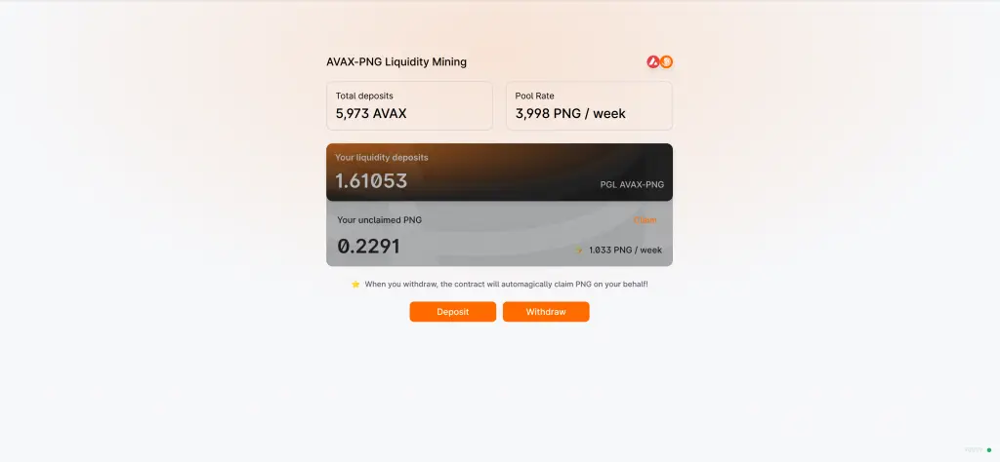

# Utiliser Pangolin

Vous pouvez utiliser Pangolin de différentes manières, pour effectuer des swap ou participer à l’apport de liquidité et recevoir des PNG.

Avant toute chose, Pangolin est utilisable via Metamask, mais sur le réseau Avalanche ! Il faudra ajouter ce réseau à votre Metamask pour pouvoir l’utiliser, voici la configuration du réseau à ajouter :

**Network Name**: Avalanche Mainnet C-Chain  
**New RPC URL**: https://api.avax.network/ext/bc/C/rpc  
**ChainID**: 43114  
**Symbol**: AVAX  
**Explorer**: https://cchain.explorer.avax.network/

### Effectuer un échange

Pour effectuer un échange, rien de plus simple : il vous faudra simplement vous rendre [sur l’interface](https://app.pangolin.exchange/#/swap) et configurer votre swap en fonction de vos besoins :

### Apporter de la liquidité

Comme pour un échange, tout se passe sur l’interface ! En quelques clics vous allez pouvoir apporter vos fonds au protocole. Pour ce faire il vous faudra deux jetons différents, avec un ratio 50/50 \(en valeur\). Par exemple 1 AVAX et environ 0.7 LINK. Mais ça peut être ce que vous voulez dans les paires disponibles !  

Cliquez simplement sur “Add Liquidity” pour accéder au panneau de configuration qui vous permettra de gérer les fonds que vous souhaitez utiliser. Attention, l’apport de liquidité n’est pas sans risque et je vous conseille de vous renseignez sur l'Impermanent Loss.

#### Farmer le jeton PNG

Maintenant que vous avez vos jetons de liquidité, vous allez pouvoir prétendre à des récompenses en jetons PNG. Pour ce faire c’est très simple, il faudra simplement bloquer vos jetons de liquidité sur [l’interface dédiée](https://app.pangolin.exchange/#/png/1).  

Vous n’avez plus qu’à retrouver votre pool et à déposer vos tokens au sein de cette dernière !

**Et voilà, vos premiers PNG seront bientôt à vous !**

